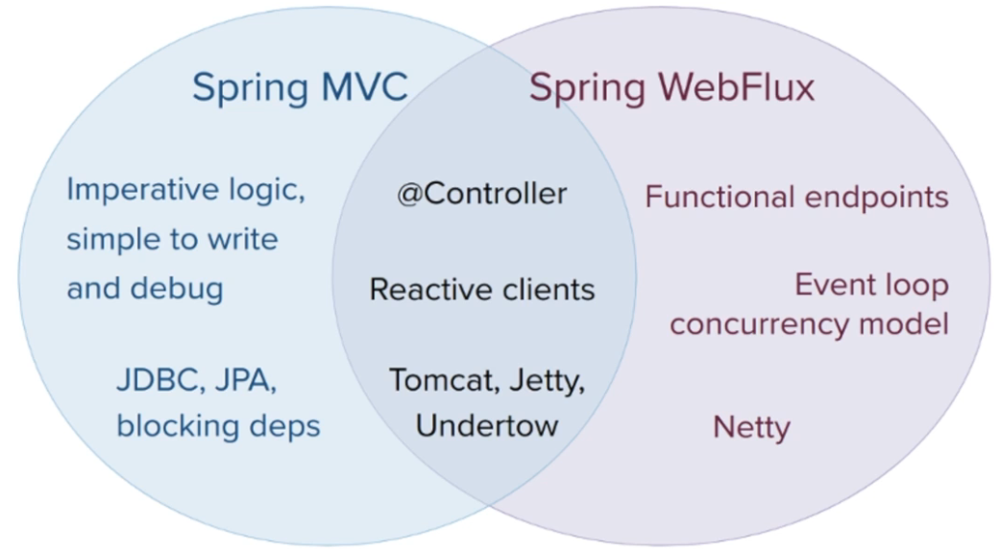

# 비동기-논블로킹 프로그래밍

## 비동기 프로그래밍

### 1.1 동기 프로그래밍

- 동기(Synchronous)방식의 프로그램에서 작업의 실행 흐름은 순차적으로 동작

```kotlin
fun main() {
    val stock: StockDto = getRealtimeStockData("APPLE")

    println("주식 심볼: ${stock.symbol}")
    println("시가: ${stock.price.open}")
    println("종가: ${stock.price.close}")
    println("시가 총액: ${stock.price.marketCap}")
}
```

- 순차적으로 동작하는 프로그램은 코드를 파악하기 쉽고 결과를 예측하기 쉬우므로 디버깅이 쉽다.
- 특정 작업을 실행하는 동안에는 다른 작업을 할 수 없다는 단점이 존재

### 1.2 비동기 프로그래밍

- 비동기(Asynchronous) 방식의 프로그램에서 작업의 실행 흐름은 기본적으로 순차적이지 않다.
- 이러한 특징으로 인해 비동기 처리 방식은 현재 실행 중인 작업이 끝나는 것을 기다리지 않고 다른 작업을 할 수 있다.
- 서버, 클라이언트 등 모든 환경에서 유용하게 사용된다.
- UI 애플리케이션의 경우 특정 이벤트가 발생할 경우에 반응하는 동작을 구현해야 하는데 이럴 때 필수적으로 비동기 프로그래밍을 사용하게 된다.

```javascript
// 버튼을 누를때마다 카운터가 증가하는 예제
const button = document.querySelector('button')

// 'click' 옆의 두번째 인자가 비동기 콜백
button.addEventListener('click', event => {
    button.innerHTML = `클릭 수: ${event.detail}`
})
```

- 대부분의 프로그래밍 언어들은 각 언어의 철학에 맞는 다양한 비동기 처리 방법들을 지원한다.
- 대표적으로 `callback`, `promise`, `future`, `async-await`, `coroutine` 등이 있고 각각의 방법들은 장점과 단점이 존재

---

## 비동기 프로그래밍 구현

### 2.1 Thread

- 가장 기본이 되는 비동기 처리 방식
- 스레드는 `Runnable` 인터페이스를 사용해 비동기 동작을 수행
- 스레드가 1개인 경우 싱글 스레드(Single Thread)라고 부르고 하나 이상 존재하는 경우 멀티 스레드(Multi Thread)라고 한다.

```kotlin
fun main() {
    for (i in 0..5) {
        val thread = Thread {
            println("current-thread-name: ${Thread.currentThread().name}")
        }
        thread.start()
    }
}
```

- 멀티 스레드를 사용하면 스케줄링 알고리즘에 의해 스레드가 전환되면서 작업을 처리하는데 이를 `컨텍스트 스위칭`이라 한다.
- 하나의 `프로세스(Process)`에는 최소한 하나 이상의 스레드가 존재하고 프로세스 내의 스레드들은 동일한 메모리를 공유한다.
- 스레드는 프로세스를 생성하는 것 보다 가볍다.
- 하지만, 스레드가 무한정 많아지면 메모리 사용량이 높아져서 `OOME(OutOfMemoryError)`가 발생할 수 있고 높은 동시 처리량을 요구하는 시스템에서는 스레드를
  생성하면서 발생하는 대기 시간 때문에
  응답 지연이 발생한다.
- 이런 문제를 해결하기 위해선 `스레드 풀(Thread Pool)`을 사용해야한다. 스레드 풀을 사용하면 애플리케이션 내에서 사용할 총 스레드 수를 제한할 수 있고 기존에 생성된
  스레드를 재사용하므로 빠른 응답이
  가능하다.
- 직접 만드는 것보다 검증된 라이브러리를 사용해야한다. `java.util.concurrent` 패키지의 `ExecutorService`를 사용하면 쉽고 안전하게 스레드 풀을
  사용할 수 있다.

```kotlin
import java.util.concurrent.ExecutorService
import java.util.concurrent.Executors

fun main() {
    val pool: ExecutorService = Executors.newFixedThreadPool(5)

    try {
        for (i in 0..5) {
            pool.execute {
                println("current-thread-name: ${Thread.currentThread().name}")
            }
        }
    } finally {
        pool.shutdown()
    }
    println("current-thread-name: ${Thread.currentThread().name}")
}
```

### 2.2 Future

- `퓨처(Future)`는 비동기 작업에 대한 결과를 얻고 싶은 경우에 사용된다.
- 예를 들어 수행 시간이 오래 걸리는 작업이나 작업에 대한 결과를 기다리면서 다른 작업을 병행해서 수행하고 싶은 경우에 유용함
- 스레드는 Runnable을 사용해 비동기 처리를 하지만 퓨처를 사용해 처리 결과를 얻기 위해선 `Callable`을 사용한다.

```kotlin
import java.util.concurrent.Callable
import java.util.concurrent.Executors

fun sum(a: Int, b: Int) = a + b

fun main() {
    val pool = Executors.newSingleThreadExecutor()

    val future = pool.submit(Callable {
        sum(100, 200)
    })

    println("계산 시작")
    val futureResult = future.get() // 블로킹 동작
    println(futureResult)
    println("계산 종료")
}
```

- `Future`을 사용하면 비동기 작업을 쉽게 구현할 수 있지만 몇 가지 단점을 가진다.
- 먼저 `get` 함수는 비동기 작업의 처리가 완료될 때까지 다음 코드로 넘어가지 않고 무한정 대기하거나 지정해둔 타임아웃 시간까지 블로킹됨
- 또한 퓨처를 사용하면 동시에 실행되는 한 개의 이상의 비동기 작업에 대한 결과를 하나로 조합하여 처리하거나 수동으로 `완료 처리(completion)` 할 수 있는 방법을
  지원하지 않음
- 이러한 단점을 보완하기 위한 API로 `CompletableFuture`이 사용된다.

```kotlin
import java.util.concurrent.CompletableFuture

fun main() {
    val completableFuture = CompletableFuture.supplyAsync {
        Thread.sleep(2000)
        sum(100, 200)
    }

    println("계산 시작")
    completableFuture.thenApplyAsync(::println) // 논블로킹 동작
//    val result = completableFuture.get() // 블로킹 동작
//    println(result)

    while (!completableFuture.isDone) {
        Thread.sleep(500)
        println("계산 결과를 집계 중입니다.")
    }

    println("계산 종료")
}
```

---

# 옵저버 패턴

## 1. 옵저버 패턴

- 옵저버 패턴(Observer Pattern)이란 GoF가 소개한 디자인 패턴중 하나로 관찰 대상이 되는 객체가 변경되면 대상 객체를 관찰하고 있는 `옵저버(Observer)`
  에게 변경사항을 `통지(Notify)`
  하는 디자인 패턴입니다.
- 옵저버 패턴을 사용하면 객체 간의 상호작용을 쉽게 하고 효과적으로 데이터를 전달할 수 있다.

### 1.1 옵저버 패턴의 구조

- 옵저버 패턴은 관찰 대상은 `서브젝트(Subject)`와 Subject를 간찰하는 `옵저버(Observer)`로 이뤄져 있다.
- 하나의 서브젝트에는 1개 또는 여러 개의 옵저버를 등록할 수 있다.
- 서브젝트의 상태가 변경되면 자신을 관찰하는 옵저버들에게 변경사항을 통지한다.
- 서브젝트로 변경사항을 통지 받은 옵저버는 부가적인 처리를 한다.
- 옵저버 패턴은 서브젝트와 옵저버를 상속하는 `구체화(Concrete)` 클래스가 존재
- 구체화 클래스는 서브젝트와 옵저버에 대한 상세 구현을 한다.

- 서브젝트의 함수
  > | 함수     | 설명                            |
    > |--------|-------------------------------|
  > | add    | 서브젝트의 상태를 관찰할 옵저버를 등록한다.      |
  > | remove | 등록된 옵저버를 삭제한다.                |
  > | notify | 서브젝트의 상태가 변경되면 등록된 옵저버에 통지한다. |

- 옵저버의 함수
  > | 함수     | 설명                                            |
    > |--------|-----------------------------------------------|
  > | update | 서브젝트의 notify 내부에서 호출되며 서브젝트의 변경에 따른 부가 기능을 처리 |

### 1.2 옵저버 패턴 구현

- JDK 1.0 부터 포함된 Observable 클래스와 Observer 인터페이스를 사용한 간단한 예제 구현
- java Observer 는 deprecated 되었으므로 `java.util.concurrent` 패키지나 `java.beans.PropertyChangeSupport`와
  같은 다양한 옵저버 패턴 구현 방식을
  사용하는 것이 좋습니다.

```kotlin

import javafx.beans.Observable
import java.util.*

class Coffee(val name: String)

// Subject
class Barista : Observable() {
    private lateinit var coffeeName: String

    fun orderCoffee(name: String) {
        this.coffeeName = name
    }

    fun makeCoffee() {
        setChanged()
        notifyObservers(Coffee(this.coffeeName))
    }
}

// Observer
class Customer(val name: String) : Observer {
    override fun update(o: java.util.Observable?, arg: Any?) {
        val coffee = arg as Coffee
        println("${name}이 ${coffee.name}을 받았습니다.")
    }
}

fun main() {
    val barista = Barista()
    barista.orderCoffee("아이스 아메리카노")

    val customer = Customer("고객1")
    barista.addObserver(customer)
    barista.makeCoffee()
}
```

- 옵저버 패턴의 장점
    - 옵저버 패턴을 사용하지 않았다면 고객은 일정 간격으로 커피가 완성됐는지 바리스타에게 확인하는 처리가 있어야 함
    - 간격이 너무 짧으면 변경된 상태를 빠르게 확인할 수 있지만 매번 불필요한 호출이 발생하므로 성능상 문제가 발생할 수 있음
    - 또한 간격이 너무 길면 변경된 상태를 즉시 확인할 수 없으므로 실시간성이 떨어질 수 있음
    - 옵저버 패턴은 관찰자인 옵저버가 서브젝트의 변화를 신경 쓰지 않고 상태 변경의 주체인 서브젝트가 변경사항을 옵저버에게 알려줌으로써 앞서 언급한 문제를 해결할 수 있다.
    - 옵저버 패턴은 데이터를 제공하는 측에서 데이터를 소비하는 측에 통지하는 `푸시 (Push-Based)` 방식이다.

- 옵저버 패턴에서 서브젝트와 옵저버는 관심사에 따라 역할과 책임이 분리되어 있다.
    - 서브젝트는 옵저버가 어떤 작업을 하는지 옵저버의 상태가 어떤지에 대해 관심을 가질 필요가 없고 오직 변경 사항을 통지하는 역할만 수행하고 하나 혹은 다수의 옵저버는 각각
      맡은 역할을 스스로 하기 때문에
      옵저버가 하는 일이 서브젝트에 영향을 끼지지 않고 옵저버는 단순한 데이터의 소비자로서 존재하게 된다.

---

# 이터레이터 패턴

## 1. 이터레이터 패턴

- `이터레이터 패턴(Iterator Pattern)`은 데이터의 집합에서 데이터를 순차적으로 꺼내기 위해 만들어진 디자인 패턴을 말함
- 이터레이터 패턴을 사용하면 컬렉션이 변경되더라도 동일한 인터페이스를 사용해 데이터를 꺼내올 수 있기 때문에 변경사항 없이 사용할 수 있다.
- 데이터의 집합이 얼만큼의 크기를 가진지 알 수 없는 경우 이터레이터 패턴을 사용하면 순차적으로 데이터를 꺼내올 수 있다.
- `어그리게잇(Aggregate)`은 요소들의 집합체를 나타낸다.
- 이터레이터는 집합체 내부에 구현된 iterator를 이용해 생성한다.
- 이터레이터를 사용하는 클라이언트는 생성된 이터레이터의 `hasNext` 함수를 사용해 데이터가 존재하는지 검사하고 `next` 함수를 사용해 데이터를 꺼낸다.

# 리액티브 프로그래밍

## 1. 리액티브 프로그래밍이란

- 리액티브 프로그래밍(Reactive Programming)은 데이터 또는 이벤트의 변경이 발생하면 이에 반응해 처리하는 프로그래밍 기법을 말한다.
- 리액티브 프로그래밍은 비동기 프로그래밍을 처리하는 새로운 접근 방식
- 2010년 에릭 마이어에 의해 마이크로소프트 .NET 에코 시스템으로 정의됨
- 리액티브 프로그래밍은 데이터의 통지, 완료, 에러에 대한 처리를 옵저버 패턴에 영감을 받아 설계되었고 데이터의 손쉬은 비동기 처리를 위해 함수형 언어의 접근 방식을 사용

### 1.1 리액티브 프로그래밍 이전의 비동기 프로그래밍

- 리액티브 프로그래밍이 나오기 전 비동기 프로그래밍은 대부분 `콜백` 기반의 비동기 처리 방식을 사용했다.

```kotlin
fetch("/api/users/me") { user ->
    fetch("/api/users/${user.id}/followers") { followers ->
        fetch("/api/users/${user.id}/likes") { likes ->
            fetch("api/users/{user.id}/contacts") { contacts ->
                // 콜백 헬
            }
        }
    }
}
```

- 간단한 콜백은 이해하기 쉬울 수 있지만 콜백이 많아져서 발생하는 `콜백 헬(Callback Hell)`로 인해 코드의 복잡도가 늘어난다.

### 1.2 리액티브 프로그래밍을 적용한 사례

- 리액티브 프로그래밍을 사용하면 콜백 헬 문제를 함수형 프로그래밍 관점으로 해결할 수 있다.

```kotlin
fetchReactive("/api/users/me")
    .zip { user -> fetchReactive("/api/users/${user.id}/followers") }
    .zip { user -> fetchReactive("/api/users/${user.id}/likes") }
    .zip { user -> fetchReactive("/api/users/${user.id}/contacts") }
    .flatMap { followers, likes, contacts ->
        // 로직 구현
    }
```

- 콜백 헬 없이 비동기 코드를 쉽게 작성할 수 있기 때문에 서버나 UI 애플리케이션 개발시 리액티브 프로그래밍이 유용하게 사용되고 있다.

---

## 2. 리액티브 스트림

- `리액티브 스트림(Reactive Stream)`은 리액티브 프로그램의 표준 API 사양을 말함
- `비동기 데이터 스트림`과 `논-블로킹 백프레셔(Back-Pressure)`에 대한 사양을 제공
- 리액티브 스트림 이전의 비동기식 애플리케이션에는 CPU의 멀티 코어를 제대로 활용하기 위해 복잡한 병렬 처리 코드가 필요했다.
- 기존의 방식은 처리할 데이터가 무한정 많아져서 시스템의 한계를 넘어서는 경우 애플리케이션은 `병목 현상`이 발생하거나 심각한 경우 애플리케이션이 정지되는 경우도 발생할 수
  있다.
- Netflix, Vmware, Red Hat, Twitter, Lightbend 등과 같은 유명 회사들이 표준화에 참여 중

### 2.1 리액티브 스트림의 다양한 구현체들

- 리액티브 스트림은 `TCK(Technology Compatibility Kit)`을 지원하기 때문에 라이브러리가 정해진 사양에 맞게 구현되었는지 보장할 수 있다.
  > TCK는 라이브러리가 정해진 사양에 맞게 구현되었는지 보장하기 위해 만들어진 도구이다.  
  > 자바 진영에선 JAVA SE 표준을 따른 JDK인지 검증하기 위해 TCK를 사용한다.
- 리액티브 스트림은 TCK만 통과한다면 각 구현체들은 표준 사양에 포함되지 않은 라이브러리만의 추가 기능도 자유롭게 지원할 수 있게 함
- **리액티브 스트림을 표준 사양으로 체택한 대표적인 구현체들**
    - Project Reactor
    - RxJava
    - JDK9 Flow
    - Akka Streams
    - Vert.x

### 2.2 리액티브 스트림 사양

- 리액티브 스트림 `사양(specification)`은 `핵심 인터페이스`와 `프로토콜`로 구성된다.
- 리액티브 스트림 인터페이스의 역할

| 인터페이스 명      | 설명                                                                                |
|--------------|-----------------------------------------------------------------------------------|
| Publisher    | 데이터를 생성하고 구독자에게 통지                                                                |
| Subscriber   | 데이터를 구독하고 통지 받은 데이터를 처리                                                           |
| Subscription | Publisher, Subscriber 간의 데이터를 교환하도록 연결하는 역할을 하며 전달받을 데이터의 개수를 설정하거나 구독을 해지할 수 있다. |
| Processor    | Publisher, Subscriber 을 모두 상속받은 인터페이스                                             |

- `발생자(Publisher)`는 데이터를 생성하고 `구독자(Subscriber)`에게 데이터를 통지하고 구독자는 자신이 처리할 수 있는 만큼의 데이터를 요청하고 처리한다.
- 이때 발행자가 제공할 수 있는 데이터의 양은 무한하고 순차적 처리를 보장
- `Subscription`은 발행자와 구독자를 연결하는 매개체이며 구독자가 데이터를 요청하거나 구독을 해지하는 등 데이터 조절에 관련된 역할을 담당
- `Processor`은 발행자와 구독자의 기능을 모두 포함하는 인터페이스이며 데이터를 가공하는 중간 단계에서 사용
- 리액티브 스트림의 데이터 처리 프로토콜
    - 리액티브 스트림은 발행자 구독자간의 데이터 전달에 사용되는 규칙을 `규약(Protocal)`로 정의하고 있다.
    - 구독자는 4개의 추상 메서드를 프로토콜을 가지고 있다.

```java
public interface Subscriber<T> {
    void onSubscribe(Subcription s);

    void onNext(T t);

    void onError(Throwable t);

    void onComplete();
}
```

- 추상 메서드 설명

| 메서드 명       | 설명                                                   |
|-------------|------------------------------------------------------|
| onSubscribe | 구독시 최초에 한번만 호출                                       |
| onNext      | 구독자가 요구하는 데이터의 수 만큼 호출 (최대 java.lang.Long.MAX_VALUE) |
| onError     | 에러 또는 더 이상 처리할 수 없는 경우                               |
| onComplete  | 모든 처리가 정상적으로 완료된 경우                                  |

- 리액티브 스트림 **데이터 처리 프로토콜**의 흐름
    - 각 메서드의 호출을 `시그널(Signal)` 이라고 부르고 각 시그널은 호출되는 순서가 다르다.
    - `onSubscribe`는 최초 구독에 대한 초기화를 담당하므로 구독시 최초 한 번만 호출되기 때문에 onSubscribe 내부에서 초기화 로직을 구현할 수 있다.
    - `onNext` 는 발행자로 부터 통지받을 데이터가 있는 경우 구독자가 요청하는 만큼 계속 호출됩니다. 이때 발행자가 통지하는 데이터의 수는 구독자가 요구하는 수와
      같거나 적어야 한다. 이런 사양이 있는
      이유는 발행자가 너무 많은 데이터를 통지해서 구독자가 처리할 수 있는 양보다 많아지면 시스템에 문제가 발생할 수 있기 때문에 적절하게 처리량을 조절하기 위함이다.
    - 발행자 측에서 처리 중 에러가 발생하면 `onError`를 구독자에게 통지하고 onError 시그널이 발생하면 더 이상 데이터를 통지하지 않는다. 구독자는 onError
      시그널을 받으면 이에 대한 에러
      처리를 할 수 있다.
    - `onComplete`는 모든 데이터를 통지한 시점에 마지막에 호출되어 데이터 통지가 성공적으로 완료되었음을 통지한다. onError와 onComplete는 반드시 둘
      중 하나만 호출되어야 하며 이후에는
      어떠한 시그널도 발생하선 안되는데 그 이유는 만약 onError가 발생하고 onComplete가 발생한다면 에러가 발생한 것인지 정상적으로 완료되었는지 판단할 수 없기
      때문이다.

---

# 스프링 WebFlux

## 1. 프로젝트 리액터

- `프로젝트 리액터(Project Reactor)`는 리액티브 스트림의 구현체 중 하나로 스프링의 에코시스템 범주에 포함된 프레임워크이다.
- 리액티브 스트림 사양을 구현하고 있으므로 리액티브 스트림에서 사용하는 용어와 규칙을 그대로 사용한다.
- 리액터를 사용하면 애플리케이션에 리액티브 프로그래밍을 적용할 수 있고 비동기-논블로킹을 적용할 수 있다.
- 함수형 프로그래밍의 접근 방식을 사용해서 비동기-논블로킹 코드의 난해함을 어느정도 해결한다.
- `백프레셔(Backpressure)`를 사용해 시스템의 부하를 효율적으로 조절할 수 있다.

### 모노와 플럭스

- 리액터는 리액티브 스트림의 `Publiser` 인터페이스를 구현하는 `모노(Mono)`와 `플럭스(Flux)`라는 두가지 핵심 타입을 제공한다.
- 모노는 0..1 개의 `단일 요소 스트림`을 통지하는 발행자이다.
- 플럭스는 0..N 개의 `다수 요소 스트림`을 통지하는 발행자이다.
- 두 타입 모두 리액티브 스트림 데이터 처리 프로토콜대로 `onComplete` 또는 `onError` 시그널이 발생할 때 까지 `onNext`를 사용해 구독자에게 데이터를
  통지한다.

**Mono.just를 사용한 Hello World예제**

```kotlin
import reactor.core.publisher.Mono

fun main() {
    val mono: Mono<String> = Mono.just("Hello Reactive World")
    mono.subcribe(::println)
}

/**
 * Hello Reactive World
 */
```

- `Mono.just(data: T)`는 객체를 인자로 받은 뒤 모노로 래핑하는 팩토리 함수이다.

**subscribe()를 호출하지 않은 경우**

```kotlin
import reactor.core.publisher.Mono

fun main() {
    val mono: Mono<String> = Mono.just("Hello Reactive World")
    println(mono)
}

/**
 * MonoJust
 */
```

- 모노와 플럭스의 연산자는 모두 `Lazy`하게 동작하여 subscribe를 호출하지 않으면 리액티브 스트림 사용대로 코드가 동작하지 않는다.
- 즉 subscribe는 `Terminal Operator(최종 연산자)`이다.
- Java 8의 스트림도 이와 유사하게 `map`, `flatMap`, `filter` 등은 중간 연산자이고 `collect`, `findFirst`, `count`등이 최종
  연산자이다.

**Flux를 사용한 예제**

```kotlin
import reactor.core.publisher.Flux

data class Cellphone(
    val name: String,
    val price: Int,
    val currency: Currency,
)
enum class Currency {
    KRW, USD
}

fun main() {
    val iphone = Cellphone(name = "Iphone", price = 100, currency = Currency.KRW)
    val galaxy = Cellphone(name = "Galaxy", price = 90, currency = Currency.KRW)
    val flux: Flux<Cellphone> = Flux.just(iphone, galaxy)
    flux.subscribe(::println)
}

/**
 * Cellphone(name = Iphone, price = 100, currency = KRW)
 * Cellphone(name = Iphone, price = 100, currency = KRW)
 */
```

- Flux는 Mono와 다르게 다수의 요소를 통지할 수 있다.

---

# 스프링 WebFlux와 스프링 MVC 비교

## 2.1 스프링 MVC

- 스프링으로 개발된 대부분의 웹 애플리케이션은 서블릿 기반의 `스프링 MVC`이다.
- 스프링MVC는 동시성 처리를 전통적인 웹 방식인 하나의 스레드가 하나의 요청을 처리하는 `Thread per Request Model`을 사용한다.
- Thread per Request Model은 DB, Network IO 등이 발생할 경우 결과를 받기까지 스레드가 블로킹됨
- 이러한 문제를 해결하기 위해 스레드 풀을 사용해 동시성을 제어한다.

## 2.2 스프링 WebFlux

- `스프링 WebFlux`는 전통적 웹 프레임워크인 `스프링 MVC`와 대비되는 `리액티브 기반의 웹 스택` 프레임워크이다.
- 기본적으로 프로젝트 리액터 기반이며 리액티브 스트림의 다른 구현체인 RxJava나 코틀린 코루틴으로도 개발이 가능하다.
- 스프링 WebFlux는 비동기-논 블로킹으로 동작하므로 적은 수의 스레드로도 대량의 동시성을 제어할 수 있다.
- 스프링 MVC와 스프링 WebFlux의 공통점과 각각이 고유하게 지원하는 기능 들
  

- 스프링 MVC
    - 명령형 코드 작성은 코드의 흐름을 쉽게 이해할 수 있고 디버깅하기 쉽다.
    - 대부분의 스프링 웹 애플리케이션이 스프링 MVC 기반이므로 안정성과 풍부한 라이브러리를 지원
    - JPA, JDBC 와 같은 블로킹 API를 사용하는 경우에는 스프링 MVC를 사용하는 것이 낫다.
- 스프링 WebFlux
    - 함수형 엔드포인트와 애노테이션 컨트롤러 방식을 모두 지원
    - 이벤트 루프 동시성 모델
    - 스프링 MVC에 비해 러닝커브가 많이 높은 편
    - 전 구간 비동기-논블로킹인 경우에 최적의 성능을 보여준다.
  ```kotlin
    // 어쩔 수 없이 블로킹 API를 쓰는 경우 별도의 스케줄러로 동작시키는 게 좋다.
    val blockingWrapper = Mono.fromCallable {
        // JPA 의 블로킹 코드
        jpaRepository.findById(id)
    }.subscribeOn(Schedulers.boundedElastic())
  ```
    - 스프링 MVC에서도 리액터와 WebFlux 의존성을 추가하여 리액티브 코드와 논블리킹 라이브러리를 사용할 수 있다.

---

# 스프링 데이터 R2DBC

## 1. R2DBC

### 1.1 R2DBC 이전

- 전통적인 방식의 `JDBC` 드라이버는 하나의 커넥션에 하나의 스레드를 사용하는 `Thread per Connection` 방식

```java
String selectSql = "SELECT * FROM employees";

try(
ResultSet resultSet = stmt.executeQuery(selectSql)){
List<Employee> employees = new ArrayList<>();

    while(resultSet.

next()){
Employee emp = new Employee();
        emp.

setid(resultSet.getInt("emp_id"));
        emp.

setName(resultSet.getString("name"));
        employees.

add(emp);
    }
            }
```

- Thread per Connection 방식은 데이터베이스로 부터 응답을 받기 전까지는 스레드는 블로킹 됨
- 높은 처리량과 대규모 애플리케이션을 위해 비동기-논블로킹 데이터베이스 API에 대한 요구가 생김
- 애플리케이션 로직이 비동기-논블로킹 이더라도 DB드라이버가 JDBC라면 필연적으로 블로킹이 발생하므로 100% 비동기-논블로킹의 성능을 내기 어려웠음
- 오라클의 `ADBA(Asynchronous Database Access API)` 프로젝트가 표준화 진행중 진행 종료 됨

### 1.2 R2DBC

- `R2DBC(Reactive Relational Database Connectivity)` 는 빠르게 성장 중인 리액티브 기반의 비동기-논블로킹 데이터베이스 드라이버
- 다양한 데이터베이스를 지원한다.
    - Oracle, PostgreSQL, H2, MySQL, Google Spanner, MariaDB 등
- 리액티브 스트림 구현체인 Project Reactor, RxJava 등을 지원

```java
connection.createStatement("SELECT * FROM employees")
        .

execute()
        .

flatMap(r ->r.

map((row, metadata) ->{
Employee emp = new Emloyee();
            emp.

setId(row.get("emp_id", Integer .class));
        emp.

setName(row.get("name"),String.class));
        return emp;
        }))
                .

close()
        .

subscribe();
```

# 스프링 WebFlux의 코루팅 지원

## 1. 코루틴

- `코루틴(Coroutine)`은 코틀린에서 비동기-논블로킹 프로그래밍을 명령형 스타일로 작성할 수 있도록 도와주는 라이브러리
- 코루틴은 멀티 플랫폼을 지원하여 코틀린을 사용하는 안드로이드, 서버 등 여러 환경에서 사용할 수 있다.
- 코루틴은 `일시 중단 가능한 함수(suspend function)`를 통해 스레드가 실행을 잠시 중단했다가 중단한 지점부터 다시 `재개(resume)`할 수 있다.
- **코루틴을 사용한 구조적 동시성 예시**
  ```kotlin
  suspend fun combineApi() = coroutineScope {
    val response1 = async { getApi1() }
    val response2 = async { getApi2() }
  
    return ApiResult {
      response1.await()
      response2.await()
    }
  }
  ```

## 2. 스프링 WebFlux의 코루틴 지원

- 스프링 WebFlux 공식문서의 코틀린 예제들을 보면 모두 코루틴 기반의 예제를 소개하고 있다.
- 스프링 MVC, 스프링 WebFlux 모두 코루틴을 지원하여 의존성만 추가하면 바로 사용 가능
- 아래 의존성을 `build.gradle.kts`에 추가하면 코루틴을 사용할 수 있다.

```kotlin
dependencies {
    implementation("org.jetbrains.kotlinx:kotlinx-coroutines-core:${version}")
    implementation("org.jetbrains.kotlinx:kotlinx-coroutines-reactor:${version}")
}
```

**리액티브가 코루틴으로 변환되는 방식**

```kotlin
// Mono -> suspend
fun handler(): Mono<Void> -> suspend fun handler()

// Flux -> Flow
fun handler(): Flux<T> -> fun handler(): Flow<T>
```

**코루틴을 적용한 컨트롤러 코드**

```kotlin
@RestController
class UserController(
    private val userService: UserService,
    private val userDetailService: UserDetailService,
) {
    @GetMapping("/{id}")
    suspend fun get(@PathVariable id: Long): User {
        return userService.getById(id)
    }

    @GetMapping("/users")
    suspend fun gets() = withContext(Despachers.IO) {
        val usersDeffered = async { userService.gets() }
        val userDetailsDeffered = async { userDetailService.await() }

        return UserList(usersDeffered.await(), userDetailsDeffered.await())
    }
}
```

**코틀린을 사용한 WebClient**

```kotlin
val client = WebClient.create("https://example.com")

val result = client.get()
    .uri("/persons/{id}", id)
    .retrieve()
    .awaitBody<Person>()
```

- 기존 리액티브 코드를 코루틴으로 변환하고 싶다면 `awaitXXX` 시작하는 확장 함수를 사용하면 즉시 코루틴으로 변환할 수 있다.

**Spring Data R2DBC의 ReactiveCrudRepository에서 코루틴 적용**
```kotlin
interface ContentReactiveRepository: ReactiveCrudRepository<Content, Long> {
    fun findByUserId(userId: Long) : Mono<Content>
    fun findAllByUserId(userId: Long): Flux<Content>
}

class ContentService (
    val repository: ContentReactiveRepository
) {
    fun findByUserIdMono(userId: Long): Mono<Content> {
        return repository.findByUserId(userId)
    }
  
    suspend fun findByUserId(userId: Long): Content {
        return repository.findByUserId(userId).awaitSingle()
    }
}
```
- `CoroutineCrudRepository`를 사용하면 `awaitXXX`코드 없이 사용 가능
```kotlin
interface ContentCouroutineRepository: CoroutineCrudRepository<Content, Long> {
    suspend fun findByUserId(userId: Long) : Content?
    fun findAllByUserId(userId: Long): Flux<Content>
}

class ContentService(
    val repository: ContentCouroutineRepository
) {
    suspend fun findByUserId(userId: Long): Content {
        return repository.findByUserId(userId)
    }
}
```